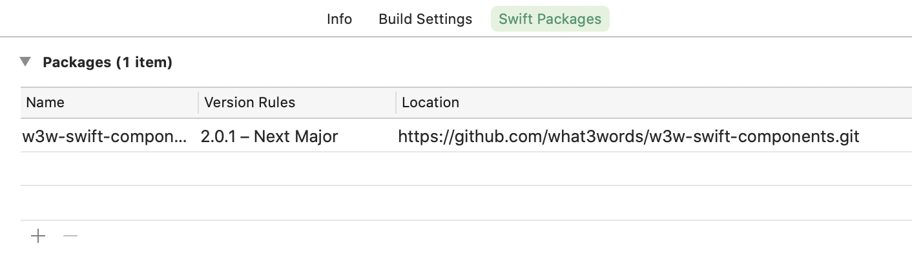
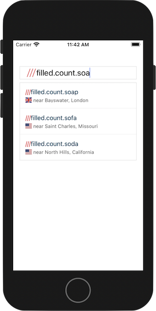

# &nbsp;w3w-swift-components tutorial

Overview
--------

This is a tutorial for using `W3WAutoSuggestTextField`.


`W3WAutoSuggestTextField` is derived from `UITextField`


Make An App With AutoSuggest Textfield
---------------------- 

#### Authentication
To use this library you’ll need a what3words API key, which can be signed up for [here](https://what3words.com/select-plan).  If you wish to use the Voice API calls then you must add a Voice API plan to your [account](https://accounts.what3words.com/billing).


#### Install Components

Add the Swift Package at [https://github.com/what3words/w3w-swift-components](https://github.com/what3words/w3w-swift-components) to your project:

```
https://github.com/what3words/w3w-swift-components.git
```

1. From Xcode's `File` menu choose `Swift Packages` then `Add Package Dependancy`.  
2. The `Choose Package Repository` window appears.  Add `https://github.com/what3words/w3w-swift-components.git` in the search box, and click on `Next`. 
3. If you are satisfied with the selected version branch choices, click `Next` again.
4. You should then be shown "Package Product" `W3WSwiftComponents`.  Choose `Finish`.

Xcode should now automatically install `w3w-swift-components`, and `w3w-swift-wrapper`




#### Write Code

In your view controller add the following import statements to the top of the file:

```Swift
import W3WSwiftApi
import W3WSwiftComponents
import CoreLocation
```


Add the following to `viewDidLoad()`:

```Swift
  override func viewDidLoad() {
    super.viewDidLoad()
    
    // instantiate the API
    let api = What3WordsV3(apiKey: "YourApiKey")
    
    // make the text field, and give it a place in the view
    let textField = W3WAutoSuggestTextField(frame: CGRect(x: 16.0, y: 64.0, width: view.frame.size.width - 32.0, height: 32.0))
    
    // assign the API to the text field
    textField.set(api)
    
    // tell autosuggest where the user is to get more relevant resultes, use the device GPS here if possible
    textField.set(options: W3WOption.focus(CLLocationCoordinate2D(latitude: 51.4243877, longitude: -0.34745)))
    
    // assign a code block to execute when the user has selected an address
    textField.onSuggestionSelected = { suggestion in
      print(suggestion.words ?? "")
    }
    
    // the error can be captured using onError
    textField.onError = { error in
      print(String(describing: error))
    }
    
    // place in the view
    view.addSubview(textField)
  }
```

#### Run The App

Give the app a run; type 'filled.count.soa' into the text field, and you should see something like this:



If you get an error, check that you used your own API key.

#### Voice Support

If your API key has been given Voice API privilege, then you can add the following line to enable it:

```
textField.set(voice: true)
```

#### Next Steps

Take a look at the [compoonents library](https://github.com/what3words/w3w-swift-components) to see the other components available for use as well as more example code.


