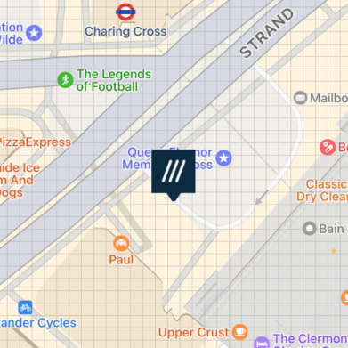

# &nbsp;Map Views


Overview
--------


This document covers the functions available in any `W3WMapViewProtocol` conforming class.  

The `W3WMapHelper`, `W3WMapView` and `W3WMapViewController` classes all do conform to `W3WMapViewProtocol`.

`W3WMapView` is a `MKMapView`, and `W3WMapViewController` is a `UIViewController` which provides a simple interactive map which can return `W3WSuggestion`s on user selection.  `W3WMapHelper` conforms to `MkMapViewDelegate` and is designed to be an easy way to get what3words functionality into you existing map view.

These components depend on [what3words swift wrapper](https://github.com/what3words/w3w-swift-wrapper).

Reference
---------

### set(language: String)

Set language will set the default language for all the calls that the map makes to the API (or SDK if you use that instead).

**examples**

```
map.set(language: "fr") // set default language to French
```

----------------

### show(_, camera: W3WCenterAndZoom, color: UIColor?, style: W3WMarkerStyle)

Show will place an annotation on the map, if the map is zoomed in, it will appear as a square, and if zoomed out it shows as a what3words annotation icon.

`show(:camera)` takes two parameters.

The first is the location, this can be a what3words address as a `String`, or a `W3WSuggestion`, `W3WSquare`, or a `CLLocatioinCorrdinate2D`.  

Note that if you pass in a `String`, or `W3WSuggestion`, a call to `convertToCoordinates` will be made automatically to get the coordinates, and this will count towards your acount quota.  This parameter can also be an array of any of the above mentioned types.

The second optional parameter is called `camera` and it indicates how to move the map view.  The choices are:

* `.zoom` - zooms the map in to the location right around the square
* `.center` - adjusts the map's center so that the location is in the center, but does not zoom in
* `.none` - this leaves the mapView showing the same area it was showing before the call

**examples**

```
map.show(square, camera: .zoom)

map.show("filled.count.soap", style: .pin)

map.show(["filled.count.soap", "index.home.raft"], camera: .center)
```

----------------

### hide()

This will hide an annotation that was previousply placed on the map.  It takes one parameter and like `show()`, it can be a what3words address as a `String`, or a `W3WSuggestion`, `W3WSquare`, or a `CLLocatioinCorrdinate2D`, or arrays of those types.

**examples**

```
map.hide(square)

map.hide("filled.count.soap")

map.hide(["filled.count.soap", "index.home.raft"])
```

----------------

### hideAll()

This will remove all what3words annotations, and squares from the map.

**examples**

```
map.hideAll()
```

----------------

### set(zoomInPointsPerSquare: CGFloat)

This will set how near the `show(twa, camera: .zoom)` calls will zoom.

`zoomInPointsPerSquare` is the size of squares in points when .zoom is used in a show() call.  (points being 1x, 2x, 3x a pixeldepending on which device you are using and if it has a "retina" dispaly.


------------

### getMapAnnotationView(annotation: MKAnnotation) -> MKAnnotationView?

If the annotion is a what3words one, this gets a renderer, otherwise it returns nil.

If you are using `W3WMapHelper` then this is typically called in your `MKMapViewDelegate`'s call: `mapView(_, viewFor: MKAnnotation)`

----------------

### updateMap()

Updates the map view with annotations and lines.  

If you are using `W3WMapHelper` then this is typically called in your `MKMapViewDelegate`'s calls: `mapViewDidChangeVisibleRegion()` `mapView(_, regionWillChangeAnimated)`, and `mapView(_, regionDidChangeAnimated)`.

----------------

### mapRenderer(overlay: MKOverlay) -> MKOverlayRenderer?

This gets a renderer for the what3words grid if it is given a `W3WMapGridLines` or `W3WMapSquareLines` overlay, otherwise it returns nil.

If you are using `W3WMapHelper` then this is typically called in your `MKMapViewDelegate`'s call: `mapView(_, rendererFor: MKOverlay)`

