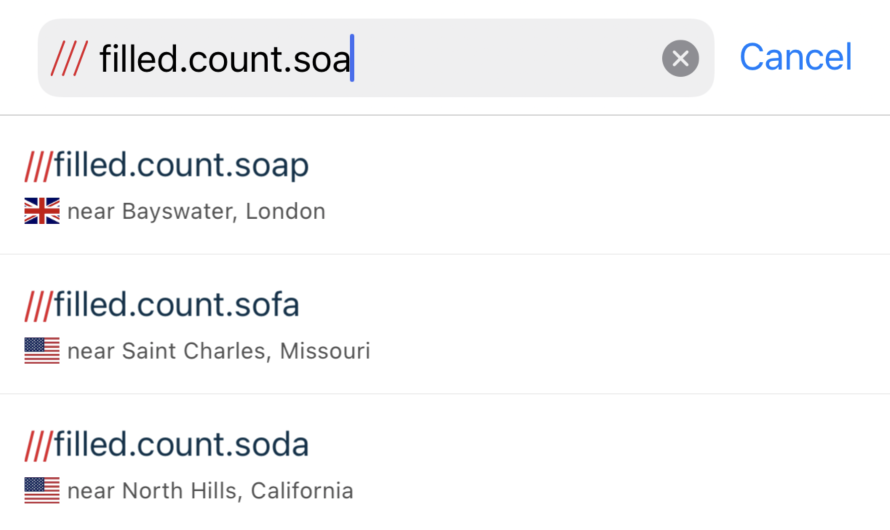

[](https://circleci.com/gh/what3words/w3w-swift-components/tree/master)
# &nbsp;w3w-swift-components

Overview
--------

A Swift library for what3words UI components. This Swift Components Package provides a straightforward way to add what3word interface functionality your app such as autosuggest text fields, map views, or what3words grid lines into your app.

It includes:

* An Autosuggest Component available as a UITextField, or UISearchController
* Map Components providing straightforward ways to include what3words squares on your MKMapView, or a full featured map view controller.

#### Notes

* These components work with **iOS 9.0** or higher.
* This package depends on the [what3words swift wrapper](https://github.com/what3words/w3w-swift-wrapper) and [swift core](https://github.com/what3words/w3w-swift-core).
* If you are upgrading from any version 1.x.x, see the [upgrade guide](./Documentation/PreviousVersions/UpgradeFromV1.md).

<a name="installation"></a>
Installation
---------------------


#### Authentication
To use this library you’ll need a what3words API key, which can be signed up for [here](https://what3words.com/select-plan).  If you wish to use the Voice API calls then you must add a Voice API plan to your [account](https://accounts.what3words.com/billing).

#### Swift Package Manager

You can install with [Swift Package Manager](https://developer.apple.com/documentation/xcode/adding_package_dependencies_to_your_app) by adding the URL below to Swift Packages under your project settings:

```
https://github.com/what3words/w3w-swift-components.git
```

Import the libraries:

```swift
import W3WSwiftApi
import W3WSwiftComponents
import CoreLocation
```

#### Note:

If you are using the Voice API on device, you should include Microphone permissions in your Info.plist:


Components
----------

### AutoSuggest Text Field


The `W3WAutoSuggestTextField` is a `UITextField` that will suggest three word addresses as the user enters text. Optionally, there is a voice recognition option.

This conforms to our `W3WAutoSuggestTextFieldProtocol`.  As such, the interface is documented at [Documentation/Autosuggest/autosuggest.md](./Documentation/Autosuggest/autosuggest.md).

---------------------- 

### AutoSuggest Search Controller


The `W3WAutoSuggestSearchController` is a `UISearchController` that will suggest three word addresses as the user enters text. This allows embedding this functionality in things such as`UINavigationController`. Optionally, there is a voice recognition option.

This conforms to our `W3WAutoSuggestTextFieldProtocol`.  As such, the interface is documented at [Documentation/Autosuggest/autosuggest.md](./Documentation/Autosuggest/autosuggest.md).

<a name="maphelper"></a>
Map Helper
-------------------
Map Helper allows you to easily integrate what3words map features into an existing map.

`W3WMapHelper` conforms to `W3WMapViewProtocol`.  A function reference  for it can be found at [Documentation/Map/map.md](./Documentation/Map/map.md)

```
let api = What3WordsV4(apiKey: "YourApiKey")
let mapHelper = W3WMapHelper(api, map: yourMKMapView)
```

If your app already has a ViewController that has a map, `W3WMapHelper` provides convenience functions to add to your `MKMapViewDelegate` functions for what3words grid and pin annotations to appear on your map. The example linked to above shows where you would place the calls, and how to instantiate the `W3WMapHelper`.

<a name="mapview"></a>
Map View
--------


`W3WMapView` conforms to `W3WMapViewProtocol `.  A function reference  for it can be found at [Documentation/Map/map.md](./Documentation/Map/map.md)

```
let api = What3WordsV4(apiKey: "YourApiKey")
let mapview = W3WMapView(api)
```

We created `W3WMapView` as a quick and dirty way to quickly get what3words functionality into your app.  

Simply replace your MKMapView with W3WMapView, and your app should behave the same as before except it will draw what3words grid lines, and have some new functions available, like `addMarker(at: "filled.count.soap")`. 

It's derived from `MKMapView` but Apple does not recommend deriving new objects from MKMapView presumably because it's interface could change in the future, so view this as a quick and dirty way to get the functionality into your app. 

The better approach would be to use `W3WMapHelper` which is designed to fit nicely into your `MKMapViewDelegate` conforming class, presumably a `UIViewController`.


<a name="mapviewcontroller"></a>
Map Component
-------------


`W3WMapViewController` conforms to `W3WMapViewProtocol `.  A function reference  for it can be found at [Documentation/Map/map.md](./Documentation/Map/map.md)

```
let api = What3WordsV4(apiKey: "YourApiKey")
let vc = W3WMapViewController(api)
```

This demonstrates `W3WMapViewController` which is a high level component that has easy to use what3words functionality.   

If you have no map in your app and want to quickly include one with some default behaviours then this one might be for you.


Settings
--------

#### Measurements

The measurement system in these components are set to the user's preference or locale automatically, but you can override this to `.metric`, or `.imperial`:

```swift
W3WSettings.measurement = .metric
```

#### Localizations

The W3WAutosuggest components have been translated into about 50 languages, and `Localizable.strings` files for these are in the Resources of this package.  In order for them to work, as with any iOS localisation settings, be sure to add the languages you want to use in your project settings under **Info** -> **Localizations**.


