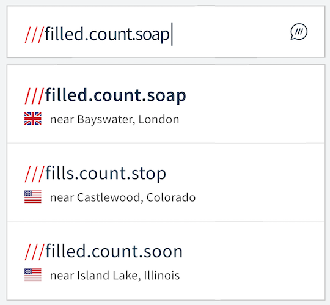

# &nbsp;w3w-swift-components

Overview
--------

A Swift library for what3words UI components. These depend on the [what3words swift wrapper](https://github.com/what3words/w3w-swift-wrapper).


AutoSuggest Text Field
---------------------- 

Full documentation can be found at [Documentation/autosuggest.md](Documentation/autosuggest.md).


An iOS UIKit example project can be found at [Examples/TextField/TextField.xcodeproj](Examples/TextField/TextField.xcodeproj)

`W3WAutoSuggestTextField` is a `UITextField` that will suggest three word addresses as the user types.  

This conforms to our `W3WAutoSuggestTextFieldProtocol` for returning any addresses the user choses, as well as to set options.


AutoSuggest Search Controller
---------------------- 

Full documentation can be found at [Documentation/autosuggest.md](Documentation/autosuggest.md).


An iOS UIKit example project can be found at [Examples/TextField/TextField.xcodeproj](Examples/TextField/TextField.xcodeproj)

`W3WAutoSuggestSearchController` is a `UISearchController` that will suggest three word addresses as the user types.  This allows embedding this functionality in things such as`UINavigationController` and `MKMap`

This also conforms to our `W3WAutoSuggestTextFieldProtocol` for returning any addresses the user choses, as well as to set options.


<a name="installation"></a>
Installation
---------------------


#### Authentication
To use this library you’ll need a what3words API key, which can be signed up for [here](https://what3words.com/select-plan).  If you wish to use the Voice API calls then you must add a Voice API plan to your [account](https://accounts.what3words.com/billing).

#### Swift Package Manager

You can install with [Swift Package Manager](https://developer.apple.com/documentation/xcode/adding_package_dependencies_to_your_app) by adding the URL below to Swift Packages under your project settings:

```
https://github.com/what3words/w3w-swift-components.git
```

Import the libraries:

```swift
import W3WSwiftApi
import W3WSwiftComponents
import CoreLocation
```


#### Note:

If you are using the Voice API on device, you should include Microphone permissions in your Info.plist:


