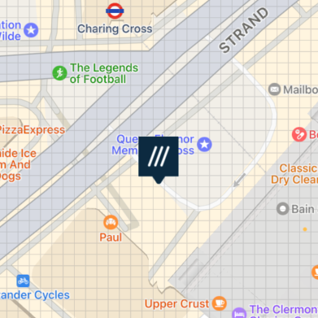

[](https://circleci.com/gh/what3words/w3w-swift-components/tree/master)
#  w3w-swift-components

Overview
--------

A Swift library for what3words UI components. These depend on the [what3words swift wrapper](https://github.com/what3words/w3w-swift-wrapper).

For information on using this package with Objective-C read [this](https://github.com/what3words/w3w-swift-components/blob/master/Documentation/ObjectiveC.md)

If you are upgrading from any version 1.x.x, see the [upgrade guide](https://github.com/what3words/w3w-swift-components/blob/master/Documentation/UpgradeFromV1.md).

#### Compatibility

These components work with **iOS 9.0** or higher.

<a name="installation"></a>
Installation
---------------------


#### Authentication
To use this library you’ll need a what3words API key, which can be signed up for [here](https://what3words.com/select-plan).  If you wish to use the Voice API calls then you must add a Voice API plan to your [account](https://accounts.what3words.com/billing).

#### Swift Package Manager

You can install with [Swift Package Manager](https://developer.apple.com/documentation/xcode/adding_package_dependencies_to_your_app) by adding the URL below to Swift Packages under your project settings:

```
https://github.com/what3words/w3w-swift-components.git
```

Import the libraries:

```swift
import W3WSwiftApi
import W3WSwiftComponents
import CoreLocation
```


#### Note:

If you are using the Voice API on device, you should include Microphone permissions in your Info.plist:


Components
----------

### AutoSuggest Text Field


Full documentation can be found at [Documentation/autosuggest.md](https://github.com/what3words/w3w-swift-components/blob/master/Documentation/autosuggest.md).


An iOS UIKit example project can be found at [Examples/TextField/TextField.xcodeproj](Examples/TextField/TextField.xcodeproj)

`W3WAutoSuggestTextField` is a `UITextField` that will suggest three word addresses as the user types.  

This conforms to our `W3WAutoSuggestTextFieldProtocol` for returning any addresses the user choses, as well as to set options.

---------------------- 

### AutoSuggest Search Controller

Full documentation can be found  at [Documentation/autosuggest.md](https://github.com/what3words/w3w-swift-components/blob/master/Documentation/autosuggest.md).


An iOS UIKit example project can be found at [Examples/TextField/TextField.xcodeproj](Examples/TextField/TextField.xcodeproj)

`W3WAutoSuggestSearchController` is a `UISearchController` that will suggest three word addresses as the user types.  This allows embedding this functionality in things such as`UINavigationController` and `MKMap`

This also conforms to our `W3WAutoSuggestTextFieldProtocol` for returning any addresses the user choses, as well as to set options.

<a name="maphelper"></a>
Map Helper
-------------------
Map Helper allows you to easily integrate what3words map features into an existing map.

`W3WMapHelper` conforms to `W3WMapViewProtocol `.  A function reference  for it can be found at [Documentation/map.md](./Documentation/map.md)

An iOS UIKit example project can be found at [Examples/MapHelper/MapHelper.xcodeproj](Examples/MapHelper/MapHelper.xcodeproj)

```
let api = What3WordsV3(apiKey: "YourApiKey")
let mapHelper = W3WMapHelper(api, map: yourMKMapView)
```

If your app already has a ViewController that has a map, `W3WMapHelper` provides convenience functions to add to your `MKMapViewDelegate` functions for what3words grid and pin annotations to appear on your map. The example linked to above shows where you would place the calls, and how to instantiate the `W3WMapHelper`.

<a name="mapview"></a>
Map View
--------

`W3WMapView` conforms to `W3WMapViewProtocol `.  A function reference  for it can be found at [Documentation/map.md](./Documentation/map.md)

An iOS UIKit example project can be found at [Examples/MapView/MapView.xcodeproj](Examples/MapView/MapView.xcodeproj)

```
let api = What3WordsV3(apiKey: "YourApiKey")
let mapview = W3WMapView(api)
```

We created `W3WMapView` as a quick and dirty way to quickly get what3words functionality into your app.  

Simply replace your MKMapView with W3WMapView, and your app should behave the same as before except it will draw what3words grid lines, and have some new functions available, like `show("filled.count.soap")`. 

It's derived from `MKMapView` but Apple does not reccomend deriving new objects from MKMapView presumably because it's interface could change in the future, so view this as a quick and dirty way to get the functionality into your app. 

The better approach would be to use `W3WMapHelper` which is designed to fit nicely into your `MKMapViewDelegate` conforming class, presumably a `UIViewController`.


<a name="mapviewcontroller"></a>
Map Component
-------------

`W3WMapViewController` conforms to `W3WMapViewProtocol `.  A function reference  for it can be found at [Documentation/map.md](./Documentation/map.md)

The iOS UIKit example project can be found at [Examples/MapComponent/MapComponent.xcodeproj](Examples/MapComponent/MapComponent.xcodeproj)

```
let api = What3WordsV3(apiKey: "YourApiKey")
let vc = W3WMapViewController(api)
```

This demonstrates `W3WMapViewController` which is a high level component that has easy to use what3words functionality.   

If you already have a map in your application then you will want to use `W3WMapHelper` instead.  Find the example called [MapHelper](Examples/MapView/MapView.xcodeproj).  

If you have no map in your app and want to quickly include one with some default behaviours then this one might be for you.


System Settings
---------------

#### Measurements

The measurement system in these components are set to the user's preference or locale automatically, but you can override this to `.metric`, or `.imperial`:

```swift
W3WSettings.measurement = .metric
```

